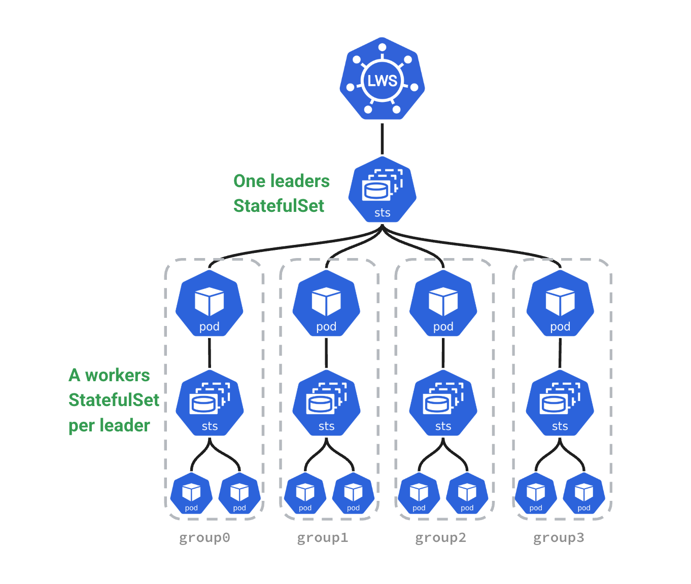

# The LeaderWorkerSet API (LWS)

[![GoReport Widget]][GoReport Status]

[GoReport Widget]: https://goreportcard.com/badge/github.com/kubernetes-sigs/lws
[GoReport Status]: https://goreportcard.com/report/github.com/kubernetes-sigs/lws

LeaderWorkerSet: An API for deploying a group of pods as a unit of replication. It aims to address common deployment patterns of AI/ML inference workloads, especially multi-host inference workloads where the LLM will be sharded and run across multiple devices on multiple nodes.
The initial design and proposal can be found at: <http://bit.ly/k8s-LWS>.

Read the [documentation](https://lws.sigs.k8s.io/docs/) or watch the LWS-related [talks & presentations](https://lws.sigs.k8s.io/docs/adoption/#talks-and-presentations) to learn more.

## Conceptual view

## Feature overview

- **Group of Pods as a unit:** Supports a tightly managed group of pods that represent a “super pod”
  - **Unique pod identity:** Each pod in the group has a unique index from 0 to n-1.
  - **Parallel creation:** Pods in the group will have the same lifecycle and be created in parallel.
  - **Gang Scheduling:** Each replica with a group of pods can be scheduled in an all-or-nothing manner (Alpha level, API may change in the future).
- **Dual-template, one for leader and one for the workers:** A replica is a group of a single leader and a set of workers, and allow to specify a template for the workers and optionally use a second one for the leader pod.
- **Multiple groups with identical specifications:** Supports creating multiple “replicas” of the above mentioned group. Each group is a single unit for rolling update, scaling, and maps to a single exclusive topology for placement.
- **A scale subresource:** A scale endpoint is exposed for HPA to dynamically scale the number replicas (aka number of groups)
- **Rollout and Rolling update:** Supports performing rollout and rolling update at the group level, which means the groups are upgraded one by one as a unit (i.e. the pods within a group are updated together).
- **Topology-aware placement:** Opt-in support for pods in the same group to be co-located in the same topology.
- **All-or-nothing restart for failure handling:** Opt-in support for all pods in the group to be recreated if one pod in the group failed or one container in the pods is restarted.

## Installation

Read the [installation guide](https://lws.sigs.k8s.io/docs/installation/) to learn more.

## Examples

Read the [examples](/docs/examples/sample/README.md) to learn more.

Also discover adopters, integrations, and talks [here](https://lws.sigs.k8s.io/docs/adoption/#talks-and-presentations).

## Community, discussion, contribution, and support

Learn how to engage with the Kubernetes community on the [community page](http://kubernetes.io/community/).

You can reach the maintainers of this project at:

- [Slack](https://kubernetes.slack.com/messages/sig-apps)
- [Mailing List](https://groups.google.com/g/kubernetes-sig-apps)

### Code of conduct

Participation in the Kubernetes community is governed by the [Kubernetes Code of Conduct](code-of-conduct.md).
