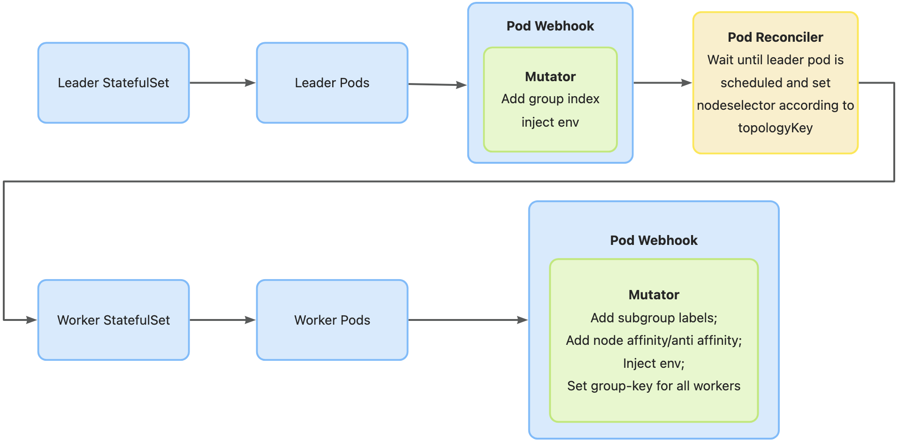

# KEP-162: Colocated placement support

<!--
A table of contents is helpful for quickly jumping to sections of a KEP and for
highlighting any additional information provided beyond the standard KEP
template.

Ensure the TOC is wrapped with
  <code>&lt;!-- toc --&rt;&lt;!-- /toc --&rt;</code>
tags, and then generate with `hack/update-toc.sh`.
-->

<!-- toc -->
- [Summary](#summary)
- [Motivation](#motivation)
  - [Goals](#goals)
  - [Non-Goals](#non-goals)
- [Proposal](#proposal)
  - [User Stories (Optional)](#user-stories-optional)
    - [Story 1](#story-1)
  - [Notes/Constraints/Caveats (Optional)](#notesconstraintscaveats-optional)
  - [Risks and Mitigations](#risks-and-mitigations)
- [Design Details](#design-details)
  - [LeaderWorkerSet API](#leaderworkerset-api)
  - [SubGroup Policy Support](#subgroup-policy-support)
  - [Test Plan](#test-plan)
      - [Unit tests](#unit-tests)
      - [Integration tests](#integration-tests)
      - [e2e tests](#e2e-tests)
  - [Graduation Criteria](#graduation-criteria)
- [Implementation History](#implementation-history)
- [Alternatives](#alternatives)
<!-- /toc -->

## Summary

<!--
This section is incredibly important for producing high-quality, user-focused
documentation such as release notes or a development roadmap. It should be
possible to collect this information before implementation begins, in order to
avoid requiring implementors to split their attention between writing release
notes and implementing the feature itself. KEP editors and SIG Docs
should help to ensure that the tone and content of the `Summary` section is
useful for a wide audience.

A good summary is probably at least a paragraph in length.

Both in this section and below, follow the guidelines of the [documentation
style guide]. In particular, wrap lines to a reasonable length, to make it
easier for reviewers to cite specific portions, and to minimize diff churn on
updates.

[documentation style guide]: https://github.com/kubernetes/community/blob/master/contributors/guide/style-guide.md
-->

This KEP aims to add spec.leaderWorkerTemplate.topologyPlacementPolicy to support exclusive and colocated placement of multiple pod groups.

## Motivation

Fine-grained topology scheduling for leaders and workers is really necessary.
In some cases, being in the same domain means lower communication costs, so that leader and its related workers are supposed to be in the same topology domain, especially for workers that distribute across multi-hosts to do inference distributively. Currently, enabling [Exclusive placement](https://github.com/kubernetes-sigs/lws/blob/main/docs/examples/sample/README.md#exclusive-placement) makes a pod group schedule to a single topology, but one topology can only have one pod group. Since this restriction isn't really necessary in all cases, we should offer finer-grained scheduling ability.

This KEP is to have LeaderWorkerSet to support colocated topology placement of one pod group.

### Goals

<!--
List the specific goals of the KEP. What is it trying to achieve? How will we
know that this has succeeded?
-->

- Add a new way of topology scheduling and allow multiple pod groups land on the same domain
- Include exclusive placement in the new field and maintain backward compatibility

### Non-Goals

<!--
What is out of scope for this KEP? Listing non-goals helps to focus discussion
and make progress.
-->

## Proposal

<!--
This is where we get down to the specifics of what the proposal actually is.
This should have enough detail that reviewers can understand exactly what
you're proposing, but should not include things like API designs or
implementation. What is the desired outcome and how do we measure success?.
The "Design Details" section below is for the real
nitty-gritty.
-->

### User Stories (Optional)

#### Story 1
Each pod group (leader and workers) is colocated in one domain(i.e., more than one group could land on the same domain)

### Notes/Constraints/Caveats (Optional)

<!--
What are the caveats to the proposal?
What are some important details that didn't come across above?
Go in to as much detail as necessary here.
This might be a good place to talk about core concepts and how they relate.
-->

### Risks and Mitigations

For now, exclusive placement is enabled by setting annotation. We want to unify the exclusive and colocated topology scheduling into one field. We can maintain backward compatibility, but we have to validate that the topology key matches in annotations and fields.

## Design Details

<!--
This section should contain enough information that the specifics of your
change are understandable. This may include API specs (though not always
required) or even code snippets. If there's any ambiguity about HOW your
proposal will be implemented, this is the place to discuss them.
-->

Similar to implementation of exclusive placement, we only need to remove podAntiAffinity part in the pod webhook. Exclusive and colocated placement are contradictory. If we add this feature to annotations too, when we enable them both in the annotations, the meaning becomes seriously ambiguous. So we think they should be unified to one field and it is necessary to change API specs.

### LeaderWorkerSet API

```go
type TopologyPlacementPolicyType string

const (
  ExclusiveTopologyPlacementPolicyType TopologyPlacementPolicyType = "Exclusive" 
  ColocatedTopologyPlacementPolicyType TopologyPlacementPolicyType = "Colocated"
  NoneTopologyPlacementPolicyType TopologyPlacementPolicyType = "None"
)

type LeaderWorkerTemplate struct {
  // +optional
  TopologyPlacementPolicy TopologyPlacementPolicy `json:"topologyPlacementPolicy",omitempty`
}

type TopologyPlacementPolicy struct {
  // +kubebuilder:default=None
  // +kubebuilder:validation=Enum={ExclusiveTopologyPlacementPolicyType,ColocatedTopologyPlacementPolicyType,NoneTopologyPlacementPolicyType}
  type TopologyPlacementPolicyType `json:"type"`
  topologyKey *string `json:"topologyKey",omitempty`
}
```

### SubGroup Policy Support
Colocated placement can support subgroup policy as well.
Compared with [exclusive support for subgroup policy](https://github.com/kubernetes-sigs/lws/assets/86417275/ff9fc93d-c738-4c09-abc8-50a7b16d49df), the workflow is almost identical, as follows:


### Test Plan

<!--
**Note:** *Not required until targeted at a release.*
The goal is to ensure that we don't accept enhancements with inadequate testing.

All code is expected to have adequate tests (eventually with coverage
expectations). Please adhere to the [Kubernetes testing guidelines][testing-guidelines]
when drafting this test plan.

[testing-guidelines]: https://git.k8s.io/community/contributors/devel/sig-testing/testing.md
-->

[X] I/we understand the owners of the involved components may require updates to
existing tests to make this code solid enough prior to committing the changes necessary
to implement this enhancement.

##### Unit tests

<!--
In principle every added code should have complete unit test coverage, so providing
the exact set of tests will not bring additional value.
However, if complete unit test coverage is not possible, explain the reason of it
together with explanation why this is acceptable.
-->

<!--
Additionally, for Alpha try to enumerate the core package you will be touching
to implement this enhancement and provide the current unit coverage for those
in the form of:
- <package>: <date> - <current test coverage>
The data can be easily read from:
https://testgrid.k8s.io/sig-testing-canaries#ci-kubernetes-coverage-unit

This can inform certain test coverage improvements that we want to do before
extending the production code to implement this enhancement.
-->

Unit tests will cover all introduced functions and complement test cases for modified existing functions.

##### Integration tests

<!--
Integration tests are contained in k8s.io/kubernetes/test/integration.
Integration tests allow control of the configuration parameters used to start the binaries under test.
This is different from e2e tests which do not allow configuration of parameters.
Doing this allows testing non-default options and multiple different and potentially conflicting command line options.
-->

<!--
This question should be filled when targeting a release.
For Alpha, describe what tests will be added to ensure proper quality of the enhancement.

For Beta and GA, add links to added tests together with links to k8s-triage for those tests:
https://storage.googleapis.com/k8s-triage/index.html
-->

- integration test of pod webhook should cover
    - pod affinity/antiaffinity is set correctly when topologyPlacementPolicyType is exclusive
- integration test of pod controller should cover
    - pod nodeselector is injected properly when topologyPlacementPolicyType is colocated
    - wait until pod is scheduled when topologyPlacementPolicyType is exclusive or colocated

##### e2e tests

<!--
This question should be filled when targeting a release.
For Alpha, describe what tests will be added to ensure proper quality of the enhancement.

For Beta and GA, add links to added tests together with links to k8s-triage for those tests:
https://storage.googleapis.com/k8s-triage/index.html

We expect no non-infra related flakes in the last month as a GA graduation criteria.
-->

When setting topologyPlacementPolicyType lws deployment will have correct pod placement(including exclusive, none, and colocated). It should also work well with other features enabled, like subgroup policy, failure handling and rolling update.

### Graduation Criteria

<!--

Clearly define what it means for the feature to be implemented and
considered stable.

If the feature you are introducing has high complexity, consider adding graduation
milestones with these graduation criteria:
- [Maturity levels (`alpha`, `beta`, `stable`)][maturity-levels]
- [Feature gate][feature gate] lifecycle
- [Deprecation policy][deprecation-policy]

[feature gate]: https://git.k8s.io/community/contributors/devel/sig-architecture/feature-gates.md
[maturity-levels]: https://git.k8s.io/community/contributors/devel/sig-architecture/api_changes.md#alpha-beta-and-stable-versions
[deprecation-policy]: https://kubernetes.io/docs/reference/using-api/deprecation-policy/
-->

## Implementation History

<!--
Major milestones in the lifecycle of a KEP should be tracked in this section.
Major milestones might include:
- the `Summary` and `Motivation` sections being merged, signaling SIG acceptance
- the `Proposal` section being merged, signaling agreement on a proposed design
- the date implementation started
- the first Kubernetes release where an initial version of the KEP was available
- the version of Kubernetes where the KEP graduated to general availability
- when the KEP was retired or superseded
-->


## Alternatives

<!--
What other approaches did you consider, and why did you rule them out? These do
not need to be as detailed as the proposal, but should include enough
information to express the idea and why it was not acceptable.
-->

We can add this feature to annotations as well by introducing new annotation "leaderworkerset.sigs.k8s.io/colocated-topology". But this will conflict with exclusive topology when enbaling them in the meanwhile. So adding new field to API spec is recommended.