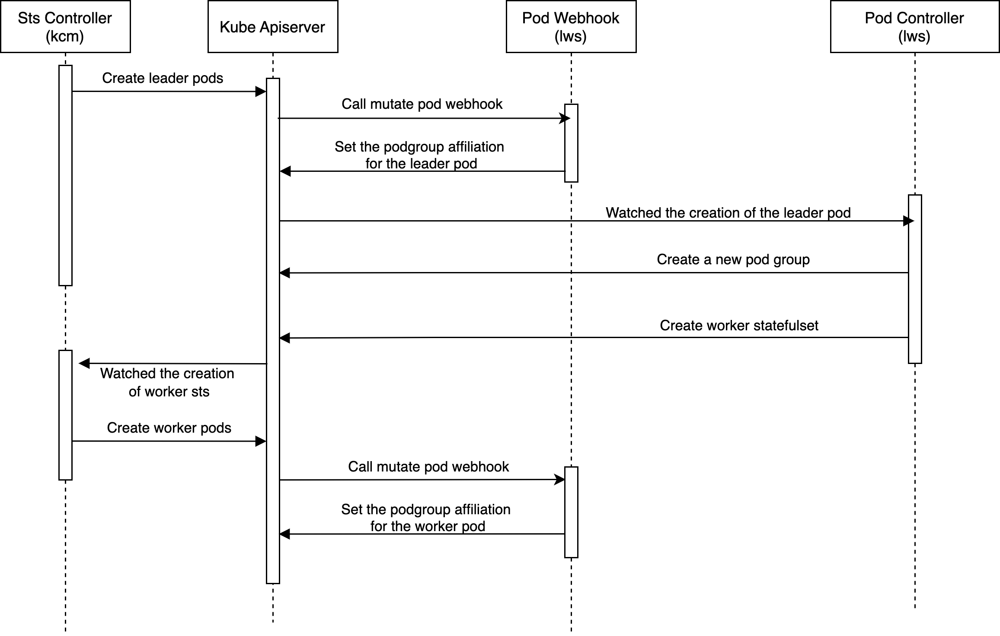

# KEP-407: Gang Scheduling

<!--
This is the title of your KEP. Keep it short, simple, and descriptive. A good
title can help communicate what the KEP is and should be considered as part of
any review.
-->

<!--
A table of contents is helpful for quickly jumping to sections of a KEP and for
highlighting any additional information provided beyond the standard KEP
template.

Ensure the TOC is wrapped with
  <code>&lt;!-- toc --&rt;&lt;!-- /toc --&rt;</code>
tags, and then generate with `hack/update-toc.sh`.
-->

<!-- toc -->
- [Summary](#summary)
- [Motivation](#motivation)
  - [Goals](#goals)
  - [Non-Goals](#non-goals)
- [Proposal](#proposal)
  - [User Stories (Optional)](#user-stories-optional)
    - [Story 1](#story-1)
  - [Notes/Constraints/Caveats (Optional)](#notesconstraintscaveats-optional)
  - [Risks and Mitigations](#risks-and-mitigations)
- [Design Details](#design-details)
  - [Interface](#interface)
  - [Sequence Diagram](#sequence-diagram)
    - [Error Handling](#error-handling)
  - [Pod Webhook](#pod-webhook)
  - [Pod Controller](#pod-controller)
  - [StartupPolicy Handling](#startuppolicy-handling)
  - [Test Plan](#test-plan)
      - [Prerequisite testing updates](#prerequisite-testing-updates)
      - [Unit tests](#unit-tests)
      - [Integration tests](#integration-tests)
      - [e2e tests](#e2e-tests)
  - [Graduation Criteria](#graduation-criteria)
- [Implementation History](#implementation-history)
- [Drawbacks](#drawbacks)
- [Alternatives](#alternatives)
<!-- /toc -->

## Summary

<!--
This section is incredibly important for producing high-quality, user-focused
documentation such as release notes or a development roadmap. It should be
possible to collect this information before implementation begins, in order to
avoid requiring implementors to split their attention between writing release
notes and implementing the feature itself. KEP editors and SIG Docs
should help to ensure that the tone and content of the `Summary` section is
useful for a wide audience.

A good summary is probably at least a paragraph in length.

Both in this section and below, follow the guidelines of the [documentation
style guide]. In particular, wrap lines to a reasonable length, to make it
easier for reviewers to cite specific portions, and to minimize diff churn on
updates.

[documentation style guide]: https://github.com/kubernetes/community/blob/master/contributors/guide/style-guide.md
-->
This KEP aims to enable gang scheduling support for LeaderWorkerSet by creating a PodGroup for each replica.
This enhancement allows custom schedulers(e.g. Volcano, coscheduling scheduler-plugin, YuniKorn etc.) to perform 
gang scheduling on the leader and its worker pods as a single unit, ensuring they are scheduled together to
avoid deadlocks.

## Motivation

<!--
This section is for explicitly listing the motivation, goals, and non-goals of
this KEP.  Describe why the change is important and the benefits to users. The
motivation section can optionally provide links to [experience reports] to
demonstrate the interest in a KEP within the wider Kubernetes community.

[experience reports]: https://github.com/golang/go/wiki/ExperienceReports
-->

Without gang scheduling support, partial scheduling may lead to resource deadlocks. 
As reported in [issue #167](https://github.com/kubernetes-sigs/lws/issues/167), when cluster resources are limited, 
the scheduler may prioritize scheduling leader pods while leaving their worker pods pending. 
This results in a situation where no inference service can serve properly, as each service requires both leader and worker pods to be running.
Gang scheduling support would ensure that pods within a replica are either all scheduled together or not scheduled at all, 
thus preventing resource deadlocks and maintaining service availability.

### Goals

<!--
List the specific goals of the KEP. What is it trying to achieve? How will we
know that this has succeeded?
-->
- Create different PodGroup resources for each lws replica for different custom schedulers (Volcano, scheduler-plugins, YuniKorn etc.) to enable gang scheduling

### Non-Goals

<!--
What is out of scope for this KEP? Listing non-goals helps to focus discussion
and make progress.
-->
- Implement specific gang scheduling policies

## Proposal

<!--
This is where we get down to the specifics of what the proposal actually is.
This should have enough detail that reviewers can understand exactly what
you're proposing, but should not include things like API designs or
implementation. What is the desired outcome and how do we measure success?.
The "Design Details" section below is for the real
nitty-gritty.
-->
LeaderWorkerSet will create a PodGroup resource for each replica and handle the association between pods and PodGroup. When creating or updating a LeaderWorkerSet, the controller will:

1. Create PodGroup resources for each replica
2. Ensure proper association between pods and their corresponding PodGroup

### User Stories (Optional)

<!--
Detail the things that people will be able to do if this KEP is implemented.
Include as much detail as possible so that people can understand the "how" of
the system. The goal here is to make this feel real for users without getting
bogged down.
-->

#### Story 1
As a user running distributed inference services with LeaderWorkerSet, I want to prevent resource deadlocks and ensure service availability in resource-constrained environments.

Currently, when cluster resources are limited, the scheduler might only schedule leader pods while leaving worker pods pending. This results in inference services being unavailable despite consuming cluster resources.

With gang scheduling support, leader and worker pods will be treated as a single scheduling unit, ensuring they are either all scheduled together or remain pending as a group. This prevents resource waste and ensures resources are only used by fully functional inference services.

### Notes/Constraints/Caveats (Optional)

<!--
What are the caveats to the proposal?
What are some important details that didn't come across above?
Go in to as much detail as necessary here.
This might be a good place to talk about core concepts and how they relate.
-->

### Risks and Mitigations

<!--
What are the risks of this proposal, and how do we mitigate? Think broadly.
For example, consider both security and how this will impact the larger
Kubernetes ecosystem.

How will security be reviewed, and by whom?

How will UX be reviewed, and by whom?

Consider including folks who also work outside the SIG or subproject.
-->

**Risk1**: Once more and more custom schedulers wants to integrate with lws, it will increase the maintenance cost of the code base.

**Mitigation**: 
- **Version Compatibility Documentation**: Maintain a clear matrix documenting LWS versions with their supported scheduler versions and PodGroup API dependencies.
- **Scheduler Team Ownership**: Each scheduler team maintains their own integration code, documentation, version compatibility, and provides clear maintainer contact information rather than centralizing maintenance in LWS core team.

**Risk2**: If PodGroup implementations do not support both minMember and minResources configurations simultaneously, different StartupPolicy options may not be perfectly supported.

**Mitigation**:
- **Documentation**: Document potential limitations in scheduler compatibility. For example, if a scheduler does not support minResources configuration, under LeaderReady StartupPolicy there may be scenarios where the leader pod is scheduled successfully but subsequent worker pods fail to be created due to insufficient cluster resources, since the scheduler cannot properly evaluate the total resource requirements of the entire replica.

## Design Details

<!--
This section should contain enough information that the specifics of your
change are understandable. This may include API specs (though not always
required) or even code snippets. If there's any ambiguity about HOW your
proposal will be implemented, this is the place to discuss them.
-->
### Interface
```go
// BaseResourceProvider defines the interface for managing base resources, like headless services, resource claims, etc.
type BaseResourceProvider interface {
    CreateHeadlessService(ctx context.Context, lws *leaderworkerset.LeaderWorkerSet) error

    CreateResourceClaim(ctx context.Context, lws *leaderworkerset.LeaderWorkerSet) error
}

// SchedulerProvider defines the interface for managing pod group resources
type SchedulerProvider interface {
    // CreatePodGroupIfNotExists creates a PodGroup if it doesn't exist, called by pod controller
    CreatePodGroupIfNotExists(ctx context.Context, lws *leaderworkerset.LeaderWorkerSet, leaderPod *corev1.Pod) error

    // InjectPodGroupMetadata sets pod meta for PodGroup association, called by webhook
    InjectPodGroupMetadata(pod *corev1.Pod) error
}

type ReplicaResourceProvider interface {
    BaseResourceProvider
    SchedulerProvider
}
```
The new interface `BaseResourceProvider` is used to manage the creation of headless services and resource claims for each replica.

And a new interface called `SchedulerProvider` will be added to manage PodGroup resources. Whenever a leader pod is created, 
the PodGroup will also be created with its OwnerReference set to the leader pod, so its lifecycle will follow the leader pod. 
This way, whether the leader pod is deleted due to scale-down of lws, deletion of lws, or any other reason, the PodGroup will also be deleted. 
Besides, during a lws rolling update, the PodGroup will be recreated along with the leader pod.
- `CreatePodGroupIfNotExists`: This method will be called by the pod controller to create a PodGroup resource for each lws replica if it doesn't already exist.
  For schedulers with PodGroup CRD (such as Volcano, coscheduling scheduler plugin), the creation logic of the corresponding PodGroup resource needs to be 
  implemented in `CreatePodGroupIfNotExists`. For schedulers like Yunikorn that do not include PodGroup CRD, simply return nil if fine.
- `InjectPodGroupMetadata`: This method will be called by pod webhook to set the PodGroup affiliation for leader pods and worker pods, 
  as different schedulers set the PodGroup affiliation in different ways. For example, in Volcano, it is done by setting the pod's annotation: 
  `scheduling.k8s.io/group-name`, while in coscheduling scheduler plugin, it is done by setting the pod's label: `scheduling.x-k8s.io/pod-group`.
  Therefore, `InjectPodGroupMetadata` directly passes in the pod object and sets labels and annotations for this pod

The interface called `ReplicaResourceProvider` is the composite interface of `BaseResourceProvider` and `SchedulerProvider`, 
the new attributes added to pod-controller and pod-webhook would also be of type `ReplicaResourceProvider`. 
If we want to add a new implementation of a custom scheduler, it needs to implement the `ReplicaResourceProvider` interface. 
Since the creation of `HeadlessService` and `ResourceClaim` is generally only one fixed implementation for lws, 
we can provide a default implementation of `BaseResourceProvider`, such as called `defaultBaseResourceProvider`, 
and then if the custom scheduler wants to implement the `ReplicaResourceProvider` interface, 
either the custom scheduler directly embeds the `defaultBaseResourceProvider` struct, or it implements the `BaseResourceProvider` interface on its own. 
In this way, if we want to provide new resources for the replica dimension in the future, we just need to modify the `BaseResourceProvider` interface
and don't need to change the `ReplicaResourceProvider` interface or `SchedulerProvider` interface. 

### Sequence Diagram
The sequence diagram of the implementation is as follows:

This diagram omits the creation of lws. After lws is created, the leader sts will be created immediately, and then as shown in the sequence diagram:
1. The sts-controller in kcm then creates leader pods
2. The pod webhook will mutate the leader pod, adding the podgroup affiliation to the labels or annotations of the leader pod. The naming convention for the podgroup is `lws.Name-groupIndex`, 
each podgroup has the same groupIndex as pods.
3. Pod controller watches the creation of the leader pod, creates the podgroup, sets the ownerReference to the leader pod, and sets the minimum resource requirements and minAvailable count for the podgroup.
4. Pod controller creates worker sts
5. Sts controller watches the creation of worker sts, creates worker pods
6. Pod webhook sets the podgroup affiliation for the worker pod as well

#### Error Handling
The sequence diagram shows the happy path of the implementation. In the sequence diagram, the changes involving the lws side include the `Pod Webhook` and `Pod Controller`, with specific error handling including: 
1. Pod Webhook (`InjectPodGroupMetadata`)

Generally, InjectPodGroupMetadata only involves setting annotations or labels for Leader/Worker pods and does not involve actual API calls, so errors will not occur.
But the interface design still retains the ability to return an error. If there is indeed a kind of implementation of `InjectPodGroupMetadata` needs to return an error, 
which means that the Leader/Worker statefulset pods creation will be rejected by pod webhook, and the sts controller in kcm(kube-controller-manager) will be responsible for backing off and retrying.
Eventually, Leader/Worker pods will be created and have the correct PodGroup association.

2. Pod Controller (`CreatePodGroupIfNotExists`)

`CreatePodGroupIfNotExists` first needs to check if the PodGroup exists, and if it doesn't, create a PodGroup. 
There is a possibility that `CreatePodGroupIfNotExists` may encounter errors such as throttling or disconnection from the API-server, 
in which case the Pod Controller will perform a fallback retry, which is already encapsulated by the controller-runtime framework.

### Pod Webhook
```go
func (p *PodWebhook) Default(ctx context.Context, obj runtime.Object) error {
	...
	if podutils.LeaderPod(*pod) {
		// After the leader pod is created, it will obtain the index of the leader pod and set the group index
		if _, found := pod.Labels[leaderworkerset.GroupIndexLabelKey]; !found {
			_, groupIndex := statefulsetutils.GetParentNameAndOrdinal(pod.Name)
			if groupIndex == -1 {
				return fmt.Errorf("parsing pod ordinal for pod %s", pod.Name)
			}
			pod.Labels[leaderworkerset.GroupIndexLabelKey] = fmt.Sprint(groupIndex)
		}
		...
	} else {
		// Since the worker sts has already been set the groupIndex label according to the leader pod's groupIndex label during creation in pod controller, 
		// no special handling is needed for worker pods
		...
	}

	// Set the podgroup affiliation for the leader pod and worker pod
	if utilfeature.DefaultFeatureGate.Enabled(features.PodGroupPerReplica) {
		err = p.SchedulerProvider.InjectPodGroupMetadata(pod)
		if err != nil {
			return err
		}
	}

	...
}
```
Because the name of podgroup is `lws.Name-groupIndex`, groupIndex can only be obtained after the leader pod is created,
and then the annotation or label of the leader pod can be patched to set the podgroup it belongs to.

While the worker pods have already been set with the groupIndex when the pod controller creates the worker sts,
so we can directly get the setting of `leaderworkerset.sigs.k8s.io/group-index` from the worker pod labels to set the podgroup name.
### Pod Controller
```go
func (r *PodReconciler) Reconcile(ctx context.Context, req ctrl.Request) (ctrl.Result, error) {
	...
	// Create headless service per replica
	if leaderWorkerSet.Spec.NetworkConfig != nil && *leaderWorkerSet.Spec.NetworkConfig.SubdomainPolicy == leaderworkerset.SubdomainUniquePerReplica {
		if err := controllerutils.CreateHeadlessServiceIfNotExists(ctx, r.Client, r.Scheme, &leaderWorkerSet, pod.Name, map[string]string{leaderworkerset.SetNameLabelKey: leaderWorkerSet.Name, leaderworkerset.GroupIndexLabelKey: pod.Labels[leaderworkerset.GroupIndexLabelKey]}, &pod); err != nil {
			return ctrl.Result{}, err
		}
	}

	// Create podgroup per replica
	if utilfeature.DefaultFeatureGate.Enabled(features.PodGroupPerReplica) {
		err = r.SchedulerProvider.CreatePodGroupIfNotExists(ctx, &leaderWorkerSet, &pod)
		if err != nil {
			return ctrl.Result{}, err
		}
	}

	...
}
```
In the pod controller, when the pod controller watched the creation of a Leader Pod, it will create a podgroup corresponding to the groupIndex, 
set the required resources and the minimum number of pods that should be Running (minAvailable), 
and set the ownerReference of the podgroup to the leader pod. In this way, the lifecycle of the podgroup is the same as the leader pod. 
When an update occurs to lws, the leader pod will be recreated, and the podgroup should also be recreated. 
During scaling down/deletion, the podgroup should also be deleted. During rolling updates, if the user has configured maxSurge, 
then additional leader pods should be created, and corresponding additional podgroups should also be created to schedule these additional pods, 
so that lws can perform rolling updates successfully.

### StartupPolicy Handling

Different `StartupPolicy` should have different MinMember settings:
- **LeaderCreated Policy (Default):** MinMember is set to the full replica size (1 leader + (size-1) workers). All pods in the replica must be scheduled together. 
- **LeaderReady Policy:** MinMember is set to 1, therefore leader pod can be scheduled immediately and won't be blocked by gang scheduler.

However, minResources should still be set to the minResources of the whole PodGroup (1 Leader + (size-1) Workers).
If the cluster resources are insufficient, scheduling the Leader Pod alone would be meaningless.

Here's a typical implementation:
```go
func (p *CustomSchedulerProvider) CreatePodGroupIfNotExists(ctx context.Context, lws *leaderworkerset.LeaderWorkerSet, leaderPod *corev1.Pod) error {
	var pg CustomPodGroup
	pgName := leaderPod.Annotations[CustomGroupNameAnnotationKey]

	if err := p.client.Get(ctx, types.NamespacedName{Name: pgName, Namespace: lws.Namespace}, &pg); err != nil {
		if client.IgnoreNotFound(err) != nil {
			return err
		}
		
		pg = CustomPodGroup{
			ObjectMeta: metav1.ObjectMeta{
				Name:      pgName,
				Namespace: lws.Namespace,
			},
			Spec: CustomPodGroupSpec{
				// Default behavior: all pods must be scheduled together
				MinMember:    *lws.Spec.LeaderWorkerTemplate.Size,
				MinResources: p.calculateMinResources(lws),
			},
		}

		// Handle LeaderReady startup policy
		if lws.Spec.StartupPolicy == leaderworkerset.LeaderReadyStartupPolicy {
			// Allow leader to be scheduled independently
			pg.Spec.MinMember = 1
			// MinResources still represents total replica's resource requirements
			// This ensures that even though only leader is required initially,
			// the scheduler can understand how many resources the replica needs
		}

		// Set optional scheduler-specific configurations
		...

		// Set OwnerReference to leader pod for lifecycle management
		err = ctrl.SetControllerReference(leaderPod, &pg, p.client.Scheme())
		if err != nil {
			return err
		}

		if err = p.client.Create(ctx, &pg); err != nil {
			return err
		}
	}

	return nil
}
```

### Test Plan

<!--
**Note:** *Not required until targeted at a release.*
The goal is to ensure that we don't accept enhancements with inadequate testing.

All code is expected to have adequate tests (eventually with coverage
expectations). Please adhere to the [Kubernetes testing guidelines][testing-guidelines]
when drafting this test plan.

[testing-guidelines]: https://git.k8s.io/community/contributors/devel/sig-testing/testing.md
-->

[ ] I/we understand the owners of the involved components may require updates to
existing tests to make this code solid enough prior to committing the changes necessary
to implement this enhancement.

##### Prerequisite testing updates

<!--
Based on reviewers feedback describe what additional tests need to be added prior
implementing this enhancement to ensure the enhancements have also solid foundations.
-->

##### Unit tests

<!--
In principle every added code should have complete unit test coverage, so providing
the exact set of tests will not bring additional value.
However, if complete unit test coverage is not possible, explain the reason of it
together with explanation why this is acceptable.
-->

<!--
Additionally, for Alpha try to enumerate the core package you will be touching
to implement this enhancement and provide the current unit coverage for those
in the form of:
- <package>: <date> - <current test coverage>
The data can be easily read from:
https://testgrid.k8s.io/sig-testing-canaries#ci-kubernetes-coverage-unit

This can inform certain test coverage improvements that we want to do before
extending the production code to implement this enhancement.
-->

All core changes must be covered by unit tests, in both pod controller and pod webhook.
- pod controller
- pod webhook

If custom scheduler adds a pod group provider implementation, should also cover unit tests.

##### Integration tests

<!--
Integration tests are contained in k8s.io/kubernetes/test/integration.
Integration tests allow control of the configuration parameters used to start the binaries under test.
This is different from e2e tests which do not allow configuration of parameters.
Doing this allows testing non-default options and multiple different and potentially conflicting command line options.
-->

<!--
This question should be filled when targeting a release.
For Alpha, describe what tests will be added to ensure proper quality of the enhancement.

For Beta and GA, add links to added tests together with links to k8s-triage for those tests:
https://storage.googleapis.com/k8s-triage/index.html
-->

The integration tests will focus on:
- Verify PodGroup is created with correct name format
- Verify leader and worker pods are correctly associated

The integration tests will be implemented in `test/integration/webhooks/pod_test.go` and `test/integration/controllers/leaderworkerset_test.go`.

##### e2e tests

<!--
This question should be filled when targeting a release.
For Alpha, describe what tests will be added to ensure proper quality of the enhancement.

For Beta and GA, add links to added tests together with links to k8s-triage for those tests:
https://storage.googleapis.com/k8s-triage/index.html

We expect no non-infra related flakes in the last month as a GA graduation criteria.
-->

Because it is necessary to install a custom scheduler and the corresponding PodGroup CRD to perform e2e testing for gang scheduling, 
therefore needs to discuss whether we need to implement e2e testing

### Graduation Criteria

<!--

Clearly define what it means for the feature to be implemented and
considered stable.

If the feature you are introducing has high complexity, consider adding graduation
milestones with these graduation criteria:
- [Maturity levels (`alpha`, `beta`, `stable`)][maturity-levels]
- [Feature gate][feature gate] lifecycle
- [Deprecation policy][deprecation-policy]

[feature gate]: https://git.k8s.io/community/contributors/devel/sig-architecture/feature-gates.md
[maturity-levels]: https://git.k8s.io/community/contributors/devel/sig-architecture/api_changes.md#alpha-beta-and-stable-versions
[deprecation-policy]: https://kubernetes.io/docs/reference/using-api/deprecation-policy/
-->

## Implementation History

<!--
Major milestones in the lifecycle of a KEP should be tracked in this section.
Major milestones might include:
- the `Summary` and `Motivation` sections being merged, signaling SIG acceptance
- the `Proposal` section being merged, signaling agreement on a proposed design
- the date implementation started
- the first Kubernetes release where an initial version of the KEP was available
- the version of Kubernetes where the KEP graduated to general availability
- when the KEP was retired or superseded
-->

KEP drafted: Apr 8th, 2025

## Drawbacks

<!--
Why should this KEP _not_ be implemented?
-->

## Alternatives

<!--
What other approaches did you consider, and why did you rule them out? These do
not need to be as detailed as the proposal, but should include enough
information to express the idea and why it was not acceptable.
-->
Podgroup creation is not done by the pod controller, but by the lws controller instead. After watching the creation of lws, 
the lws controller then creates the corresponding number of podgroups based on the lws replicas, 
setting the podgroup's ownerReference to lws. However, this approach will be more complex, it requires creating and deleting the corresponding podgroup when scaling down or up, 
and during rolling updates, not only the old podgroup may needs to be updated, but additional podgroups may also need to be created if maxSurge is configured